# Fellowship Finance Database — Schema Reference

PostgreSQL 13+. Requires the `pgcrypto` extension (UUID generation) and
`postgis` extension (member/visitor location storage and proximity queries).

## Entity-relationship diagram

```mermaid
erDiagram
    USERS ||--o{ MEMBERS : "entered_by / updated_by"
    USERS ||--o{ VISITORS : "entered_by / updated_by"
    USERS ||--o{ TRANSACTIONS : "entered_by / updated_by"
    USERS ||--o{ TRANSFERS : "entered_by / updated_by"
    USERS ||--o{ VISITOR_VISITS : recorded_by
    USERS ||--o{ AUDIT_LOG : changed_by
    USERS ||--o{ REPORT_RUNS : generated_by

    FELLOWSHIP_GROUPS ||--o{ MEMBERS : fellowship_group_id
    FELLOWSHIP_GROUPS ||--o{ VISITOR_VISITS : fellowship_group_id

    MEMBERS ||--o{ VISITORS : invited_by_member_id
    MEMBERS ||--o| VISITORS : converted_member_id
    MEMBERS ||--o{ TRANSACTIONS : member_id
    MEMBERS ||--o{ FELLOWSHIP_TARGETS : "member_id (override)"

    VISITORS ||--o{ VISITOR_VISITS : visitor_id

    ACCOUNTS ||--o{ TRANSACTIONS : account_id
    ACCOUNTS ||--o{ TRANSFERS : from_account_id
    ACCOUNTS ||--o{ TRANSFERS : to_account_id

    FUNDS ||--o{ TRANSACTIONS : fund_id

    CATEGORIES ||--o{ TRANSACTIONS : category_id
    CATEGORIES ||--o{ CATEGORIES : parent_category_id
    CATEGORIES ||--o{ FELLOWSHIP_TARGETS : target_category_id

    TRANSACTIONS ||--o{ TRANSACTIONS : related_transaction_id

    USERS {
        uuid id PK
        text full_name
        text email UK
        text role
        timestamptz created_at
    }

    ACCOUNTS {
        uuid id PK
        text name UK
        text account_type
        text currency
        numeric opening_balance
        bool is_active
    }

    FUNDS {
        uuid id PK
        text name UK
        text description
        bool is_restricted
        bool is_active
    }

    CATEGORIES {
        uuid id PK
        text name
        text category_type
        uuid parent_category_id FK
    }

    FELLOWSHIP_GROUPS {
        uuid id PK
        text name UK
        text description
        bool is_active
    }

    MEMBERS {
        uuid id PK
        text full_name
        text phone_number
        text gender
        text member_status
        bool is_active
        bool baptism_status
        date baptism_date
        bool confirmation_status
        date confirmation_date
        uuid fellowship_group_id FK
        text general_area
        text location_status
        geography location
        uuid entered_by FK
        uuid updated_by FK
        timestamptz created_at
        timestamptz updated_at
    }

    VISITORS {
        uuid id PK
        text full_name
        text phone_number
        text gender
        text general_area
        text location_status
        geography location
        uuid invited_by_member_id FK
        text how_heard
        date first_visit_date
        text visitor_status
        uuid converted_member_id FK
        timestamptz converted_at
        text notes
        uuid entered_by FK
        uuid updated_by FK
        timestamptz created_at
        timestamptz updated_at
    }

    VISITOR_VISITS {
        uuid id PK
        uuid visitor_id FK
        date visit_date
        uuid fellowship_group_id FK
        uuid recorded_by FK
    }

    TRANSACTIONS {
        uuid id PK
        uuid account_id FK
        uuid category_id FK
        uuid fund_id FK
        uuid member_id FK
        uuid related_transaction_id FK
        numeric amount
        date transaction_date
        text description
        uuid entered_by FK
        uuid updated_by FK
        bool is_voided
        text voided_reason
        timestamptz created_at
        timestamptz updated_at
    }

    TRANSFERS {
        uuid id PK
        uuid from_account_id FK
        uuid to_account_id FK
        numeric amount
        date transfer_date
        text description
        uuid entered_by FK
        uuid updated_by FK
        bool is_voided
        text voided_reason
        timestamptz created_at
    }

    AUDIT_LOG {
        uuid id PK
        text table_name
        uuid record_id
        text action
        uuid changed_by FK
        timestamptz changed_at
        jsonb diff
    }

    REPORT_RUNS {
        uuid id PK
        date period_start
        date period_end
        timestamptz generated_at
        uuid generated_by FK
        text pdf_path
    }

    FELLOWSHIP_TARGETS {
        uuid id PK
        uuid target_category_id FK
        uuid member_id FK
        text member_status
        int year
        text period
        numeric target_amount
    }
```

> Mermaid's ER notation doesn't have a clean way to draw "this FK is only
> populated after an event" (`visitors.converted_member_id`), so that
> relationship is drawn as optional (`||--o|`) — it stays `NULL` until a
> visitor actually converts.

## Table reference

### Core / people

**`users`**
Login accounts for treasurers, admins, and viewers. Every mutation elsewhere
in the schema (`entered_by`, `updated_by`, `changed_by`, `recorded_by`,
`generated_by`) points back here, so this is who did what.

**`members`**
The fellowship's membership roll. Beyond the basics (name, phone, gender,
active status, and a `member_status` of `student`/`working`/`retired`), it
holds the sacramental record (baptism/confirmation status and dates), which
`fellowship_groups` a member belongs to, and location — a
free-text general area, a `location_status` relative to the parish
(within/outside/diaspora), and a precise `geography` point for mapping and
proximity queries (e.g. "who lives within 5km of church"). Tracked by
`entered_by`/`updated_by` and audited via `audit_log`.

**`visitors`**
People who've attended but aren't members yet. Deliberately a separate
table rather than a status flag on `members`, so a first-timer never
touches member-scoped logic (giving targets, fund contributions) until
they actually convert. Carries gender and the same location fields as
`members`, plus
who invited them, how they heard about the fellowship, and a
`visitor_status` (`active` / `converted` / `lapsed`). Once converted,
`converted_member_id` and `converted_at` are set and the row becomes
read-only history.

**`visitor_visits`**
One row per time a visitor actually showed up — the attendance log a
scheduled job reads to decide who's ready to transition to full membership
(see `visitor_conversion_candidates` below).

**`fellowship_groups`**
Lookup table for the fellowship a member (or a visitor's attendance) is
associated with — Men's, Women's, Youth, Children's, etc. Kept as a table
rather than a fixed list so the church can add or rename groups without a
schema change.

### Money

**`accounts`**
The physical places money sits — bank accounts and mobile-money/cash tills.
Carries an `opening_balance`; the running balance is derived, not stored
(see `account_balances` view).

**`funds`**
What pool of money a transaction belongs to (e.g. a building fund, a
mission trip fund). `is_restricted` marks funds that can only be spent on
their stated purpose.

**`categories`**
The nature of a transaction — income or expense — with self-referencing
`parent_category_id` for subcategories (e.g. "Transport" under "Expenses").

**`transactions`**
Every income/expense entry. `amount` is always stored positive; direction
comes from the linked category's `category_type`. Can optionally tie to a
`member` (registration fee, contribution) and to another transaction via
`related_transaction_id` (e.g. a refund tied to the original charge).
Supports soft-deletion via `is_voided`/`voided_reason` rather than hard
deletes, and is fully audited.

**`transfers`**
Money moving between two of the fellowship's own accounts — not
income or expense, so kept separate from `transactions`.

**`fellowship_targets`**
Giving targets by category, per year, at three levels of specificity (most
specific wins): a named member override, a status-group target
(all students / all working members), or one uniform target for everyone.
`period` says whether `target_amount` is a per-year or per-month figure.

### Records & reporting

**`audit_log`**
Generic change history. A trigger (`log_audit_event`) fires on
`INSERT`/`UPDATE`/`DELETE` for `transactions`, `transfers`, `members`, and
`visitors`, storing a JSON diff regardless of which tool or user issued
the change.

**`report_runs`**
A record of every generated financial report — the period it covers, who
generated it, and where the PDF lives.

## Views & functions

**`account_balances`** — current balance per account (opening balance +
transactions + transfers in − transfers out), excluding voided rows.

**`general_ledger`** — one chronological, read-only feed combining
transactions and transfers, for a single "everything that happened"
report.

**`visitor_conversion_candidates`** — active visitors with 4+ logged
visits, i.e. who a scheduled job should consider transitioning to
membership. Threshold is a starting point — tune to your church's actual
policy.

**`convert_visitor_to_member(p_visitor_id, p_entered_by, p_member_status)`**
— the transition itself: inserts a new `members` row from the visitor's
details (carrying location across), marks the visitor `converted`, and
links the two records.
