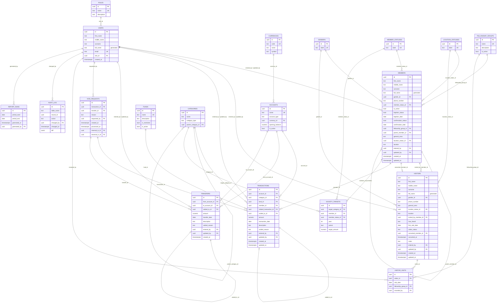

# Church Finance & Congregation Database — Schema Reference

PostgreSQL 13+. Requires the `pgcrypto` extension (UUID generation)and
`postgis` extension (member/visitor location storage and proximity queries).

## Entity-relationship diagram

> Mermaid's ER notation doesn't have a clean way to draw "this FK is only
> populated after an event" (`visitors.converted_member_id`) or "this FK is
> only set on a reversal row" (`voided_tx_id` on `transactions`/`transfers`)
> — both are drawn as optional (`||--o|`), meaning `NULL` until that event
> actually happens.

## Table reference

### Lookups

**`roles`** / **`currencies`** / **`genders`** / **`member_statuses`** / **`location_statuses`**
Small reference tables standing in for what used to be inline `CHECK`
constraints on `users.role`, `accounts.currency`, `members.gender`,
`members.member_status`, and `members.location_status`. The trade-off is a
join wherever these values are read, in exchange for never needing a schema
migration to add a new role, currency, gender category, or status — and
consistency with the pattern `fellowship_groups` already used.

### Core / people

**`users`**
Login accounts for treasurers, admins, and viewers, linked to a `role` via
`role_id`. Name is stored as `first_name` / `middle_name` / `surname`;
`full_name` is a **generated column** (`GENERATED ALWAYS AS ... STORED`)
that concatenates them, so every existing view or join that reads
`full_name` keeps working without change. Every mutation elsewhere in the
schema (`entered_by`, `updated_by`, `changed_by`, `recorded_by`,
`generated_by`) points back here.

**`members`**
The fellowship's membership roll. Name follows the same
first/middle/surname + generated `full_name` pattern as `users`. Beyond the
basics (gender, active status, and a `member_status` — Student/Working/
Retired, now looked up rather than inline), it holds the sacramental record
(baptism/confirmation status and dates), which `fellowship_group` a member
belongs to, a self-reference (`parent_member_id`) for a child/youth member's
parent or guardian, and location — a free-text `general_area`, a
`location_status` relative to the circuit, and a `location_text` text field, and
`location_geo` a PostGIS `geography(Point, 4326)` column with a
spatial index, supporting proximity queries directly in SQL.

**`visitors`**
People who've attended but aren't members yet. Same name-splitting and
lookup-table pattern as `members`. Deliberately a separate table rather
than a status flag on `members`, so a first-timer never touches
member-scoped logic (giving targets, fund contributions) until they
actually convert. Once converted, `converted_member_id` and `converted_at`
are set and the row becomes read-only history.

**`visitor_visits`**
One row per time a visitor actually showed up — the attendance log a
scheduled job reads to decide who's ready to transition to full membership
(see `visitor_conversion_candidates` below).

**`fellowship_groups`**
Lookup table for the fellowship a member (or a visitor's attendance) is
associated with — Men's, Women's, Youth, Children's, etc.

### Money

**`accounts`**
The physical places money sits — bank accounts and mobile-money/cash tills.
`currency_id` points at `currencies` rather than a free-text code, so a new
currency doesn't need a schema change. Carries an `opening_balance`; the
running balance is derived, not stored (see `account_balances`).

**`funds`**
What pool of money a transaction belongs to. `is_restricted` marks funds
that can only be spent on their stated purpose.

**`categories`**
The nature of a transaction — income or expense — with self-referencing
`parent_category_id` for subcategories.

**`transactions`**
Every income/expense entry. `amount` is stored positive on ordinary
entries; direction still comes from the linked category's `category_type`.

*Voiding, reworked:* there's no `is_voided` flag anymore. Voiding a
transaction inserts a second row — same account/category/fund/member, the
amount negated, `voided_tx_id` pointing back at the original — rather than
flipping a boolean on the original row. Because direction comes from
`category_type` and the reversal keeps the same category, negating the
amount cancels the original exactly under a plain `SUM()`, with nothing to
filter on. `void_transaction()` (bottom of the schema file) builds this
reversal row for you and refuses to double-void the same transaction or
void a reversal row itself; a partial unique index enforces the "voided at
most once" rule at the database level too.
Because of data entry procedures, any voided request will be entered into
the table `void requests` this table will then submit to the function
`void_transaction()` via the `process_void_request()` function.

**`transfers`**
Money moving between two of the fellowship's own accounts. Voided the same
way as `transactions` — see `void_transfer()`.

**`society_targets`**
Giving targets by category, per year, at three levels of specificity (most
specific wins): a named member override, a status-group target, or one
uniform target for everyone. `period` says whether `target_amount` is a
per-year or per-month figure. (Renamed from `fellowship_targets` — same
shape, new name.)

### Records & reporting

**`audit_log`**
Generic change history. A trigger (`log_audit_event`) fires on
`INSERT`/`UPDATE`/`DELETE` for `transactions`, `transfers`, `members`, and
`visitors`, storing a JSON diff regardless of which tool or user issued
the change. This includes reversal rows — voiding a transaction shows up
in the audit trail as its own `INSERT`, same as any other entry.

**`report_runs`**
A record of every generated financial report — the period it covers, who
generated it, and when. No longer stores the PDF itself, and there's no
uniqueness constraint on the period: rerunning a report for a period that's
already been reported on is expected, and every run gets its own row.

## Views & functions

**`account_balances`** — current balance per account (opening balance +
transactions + transfers in − transfers out). No voided-row filter needed:
reversal entries cancel under a plain sum.

**`general_ledger`** — one chronological, read-only feed combining
transactions and transfers. `is_voided`/`voided_reason` booleans are
replaced by `is_reversal` (true on a reversal row) and `voids_entry_date`
(the date of the entry it cancels, when applicable).

**`visitor_conversion_candidates`** — active visitors with 4+ logged
visits, i.e. who a scheduled job should consider transitioning to
membership. Threshold is a starting point — tune to your church's actual
policy.

**`convert_visitor_to_member(p_visitor_id, p_entered_by, p_member_status_id)`**
— the transition itself: inserts a new `members` row from the visitor's
details, marks the visitor `Converted`, and links the two records.
`p_member_status_id` defaults to `'Working'` if not supplied.

**`void_transaction(p_transaction_id, p_entered_by, p_reason)`** /
**`void_transfer(p_transfer_id, p_entered_by, p_reason)`** — build the
mirrored, negative-amount reversal row described above. Raises an
exception if the target has already been voided, or is itself a reversal
row.

## Known downstream impact

The R Shiny dashboard (`church_dashboard.R`) reads `general_ledger.is_voided`
and `.voided_reason` directly — the "Show voided entries" checkbox and the
ledger table's columns will need updating to use `is_reversal` and
`voids_entry_date` instead. Not done as part of this schema pass; flagging
so it doesn't surprise you next deploy.